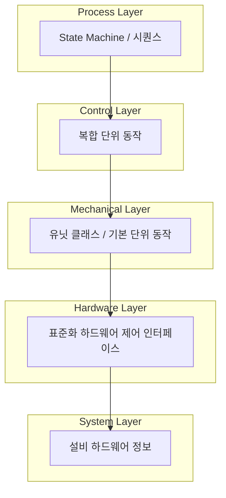

# 설비 제어 코드 아키텍처

## 1. 개요

생성 대상인 설비 제어 코드는 **5계층 레이어드 아키텍처**를 따른다. 각 레이어는 하위 레이어만 참조하며, 설계 자료(하드웨어 명세·UML)와 코드 생성·LLM 입출력은 이 구조에 맞춰 매핑한다.

### 1.1 기술 스택 (현재 및 전환 예정)

- **현재**: C# **.NET Framework** 기반, **WinForms**로 동작
- **전환 예정**: **.NET**(현대 .NET, 예: .NET 6/8)으로 마이그레이션. UI는 WinForms on .NET 등 전환 후 스택에 맞춰 사용

---

## 2. 5계층 구조

| 레이어 | 역할 | 코드 생성·입출력와의 관계 |
|--------|------|---------------------------|
| **System Layer** | 설비 하드웨어 정보 보유 | **입력**: 하드웨어 명세 문서가 이 레이어의 데이터 소스가 됨 |
| **Hardware Layer** | 제조사별 라이브러리와 통신, 표준화된 제어 인터페이스 제공 | 공통/표준 인터페이스 → 템플릿 또는 재사용 라이브러리, 생성 시 참조 |
| **Mechanical Layer** | 설비별 **유닛** 1개 = 1클래스, 독립 구동 가능한 기본 단위 동작 | **생성 대상**: 하드웨어 구성 + 유닛 정의에 따라 클래스/메서드 생성 |
| **Control Layer** | Mechanical 1개 이상을 조합한 복합 단위 동작 | **생성 대상**: UML/동작 명세에서 복합 시퀀스 → 클래스·메서드 생성 |
| **Process Layer** | 개별 스레드, State Machine, 설비 전체 시퀀스 구동 | **생성 대상**: Draw.io UML(상태/시퀀스) → 스레드·상태머신·시퀀스 코드 |

---

## 3. 레이어별 요약

### 3.1 System Layer (최하위)

- 설비의 **하드웨어 정보**를 보유 (축, IO, 로봇, 네트워크/주소 등).
- 설정 클래스, 상수, 하드웨어 목록 데이터 형태로 구현.
- **설계 자료**: 하드웨어 명세 전체가 이 레이어의 입력이 됨.

### 3.2 Hardware Layer

- 각 하드웨어 제조사의 라이브러리와 통신하면서 **표준화된 하드웨어 제어 인터페이스**를 제공.
- 축 제어, IO 제어, 로봇 통신 등을 래핑.
- **설계 자료**: 하드웨어 명세 중 제조사·프로토콜·채널/노드 매핑.

### 3.3 Mechanical Layer

- 설비마다 다르며, **독립적으로 구동 가능한 단위 = 유닛**을 하나의 클래스로 구현.
- 기본적인 단위 동작(이동, 그립, 신호 대기 등)을 메서드로 제공.
- **설계 자료**: 하드웨어 명세의 유닛–하드웨어 매핑, 유닛 목록·기본 단위 동작 정의.

### 3.4 Control Layer

- **하나 이상의 Mechanical 레이어 클래스**를 이용해 더 **복합적인 단위 동작**을 구현.
- **설계 자료**: UML의 복합 시퀀스, 유닛 조합 정보.

### 3.5 Process Layer (최상위)

- **각각 개별 스레드**로 동작하며, **State Machine** 형태로 설비 전체 시퀀스를 구동.
- **설계 자료**: Draw.io UML의 상태 다이어그램·시퀀스 다이어그램.

---

## 4. 설계 자료와의 매핑

- **하드웨어 명세** → System Layer 설정값, Hardware Layer 드라이버/채널 바인딩 입력.
- **UML(동작/시퀀스)** → Mechanical / Control / Process 레이어의 동작·시퀀스 구현에 반영.

---

## 5. 참조 문서

- [01-요구사항명세서.md](01-요구사항명세서.md)
- [03-하드웨어명세-스키마.md](03-하드웨어명세-스키마.md)
- [04-UML-동작명세-가이드.md](04-UML-동작명세-가이드.md)
- [05-레이어별-코드생성-프롬프트명세.md](05-레이어별-코드생성-프롬프트명세.md)
