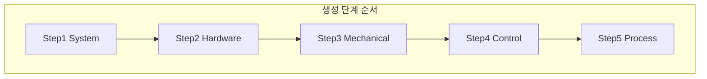

# 레이어별 코드 생성 절차 및 프롬프트 명세

## 1. 단계적 생성 흐름 개요

LLM은 **한 번에 전체 코드를 생성하지 않고**, 아래 순서대로 **레이어별로 한 단계(한 태스크)씩** 호출된다. 이전 단계의 생성 결과(파일 경로·클래스명·인터페이스)는 다음 단계의 컨텍스트로 전달한다.

| 단계 | 레이어 | 설계 자료 참조 | 생성물 대략 |
|------|--------|----------------|-------------|
| Step 1 | System | 하드웨어 명세 전체 | 설정 클래스, 상수, 하드웨어 목록 데이터 |
| Step 2 | Hardware | 하드웨어 명세(제조사·프로토콜·채널) | 표준 인터페이스 구현체, 드라이버 래퍼 |
| Step 3 | Mechanical | 하드웨어 명세(유닛-하드웨어 매핑) + 유닛 목록/동작 정의 | 유닛별 클래스 1개, 기본 단위 동작 메서드 |
| Step 4 | Control | UML(복합 시퀀스)·유닛 목록 + Step3 출력 | Mechanical 조합 클래스, 복합 단위 동작 |
| Step 5 | Process | Draw.io UML(상태/시퀀스) + Step3·Step4 출력 | 스레드·상태머신·전체 시퀀스 진입점 |

- 구현 시 **한 단계 = 한 번의 LLM 요청**(또는 한 레이어 내 파일 단위 소규모 요청)으로 두고, 각 요청에 **해당 레이어 전용 프롬프트**를 사용한다.
- **타깃**: C# .NET(예: .NET 6/8). 설비 제어 코드는 .NET Framework + WinForms에서 **.NET 전환 예정**이므로, 생성 코드는 .NET 타깃으로 작성하고, UI는 WinForms on .NET 등 전환 후 스택에 맞는 라이브러리만 참조한다.

---

## 2. 레이어별 설계 자료 참조 규칙 및 코드 작성 위치

### 2.1 Step 1 — System Layer

- **참조할 설계 자료**
  - 하드웨어 명세 **전체**: 축 목록, IO 보드 종류·채널 수, 로봇 대수·프로토콜, 네트워크/주소, 안전 IO 등.
- **참조하지 않는 것**
  - UML(동작/시퀀스)은 이 단계에서 사용하지 않음.
- **코드 작성 위치 규칙**
  - 네임스페이스: `{Solution}.System` 또는 `Equipment.System`.
  - 폴더: `src/System/` 또는 `Equipment/System/`.
  - 파일: 하드웨어 목록·축/IO/로봇 설정을 담은 설정 클래스 또는 상수 파일 (예: `EquipmentHardwareConfig.cs`, `AxisDefinitions.cs`).
  - **규칙**: 설계 자료의 설비 식별자·축 ID·IO 채널 번호·로봇 노드 등이 그대로 상수·설정 프로퍼티로 매핑되도록 명시.

### 2.2 Step 2 — Hardware Layer

- **참조할 설계 자료**
  - 하드웨어 명세 중 **제조사·프로토콜·채널/노드 매핑** 부분, 제조사/드라이버 매핑 테이블.
- **참조하는 이전 단계 출력**
  - Step 1에서 만든 System 설정(클래스명·상수명)·경로.
- **코드 작성 위치 규칙**
  - 네임스페이스: `{Solution}.Hardware` 또는 `Equipment.Hardware`.
  - 폴더: `src/Hardware/`, 필요 시 `Drivers/`, `Abstractions/` 등 하위 폴더.
  - 파일: 축 제어 인터페이스 구현, IO 보드 래퍼, 로봇 통신 래퍼 등. 설계 자료의 제조사/보드 타입별로 어떤 C# 드라이버를 쓰는지 매핑을 프롬프트 또는 공통 문서로 제공.

### 2.3 Step 3 — Mechanical Layer

- **참조할 설계 자료**
  - 하드웨어 명세 중 **유닛–하드웨어 매핑**(어떤 축/IO/로봇이 어떤 유닛에 속하는지).
  - 유닛 목록 및 **기본 단위 동작** 정의(문서 또는 UML의 유닛 단위 동작 부분).
- **참조하는 이전 단계 출력**
  - Step 1 설정, Step 2 Hardware 인터페이스/클래스 경로·메서드 시그니처.
- **코드 작성 위치 규칙**
  - 네임스페이스: `{Solution}.Mechanical` 또는 `Equipment.Mechanical`.
  - 폴더: `src/Mechanical/` 또는 `Mechanical/Units/`.
  - 파일: **유닛 1개 = 1클래스** (예: `ConveyorUnit.cs`, `RobotStationUnit.cs`). 설계 자료의 유닛 ID·이름과 클래스명/파일명 매핑 규칙을 프롬프트에 명시 (예: PascalCase, 접미사 `Unit`).

### 2.4 Step 4 — Control Layer

- **참조할 설계 자료**
  - UML 중 **복합 시퀀스**(여러 유닛을 조합한 흐름). 유닛 목록 및 어떤 Control이 어떤 Mechanical 유닛들을 사용하는지.
- **참조하는 이전 단계 출력**
  - Step 3 Mechanical 유닛 클래스 목록·공개 메서드 시그니처.
- **코드 작성 위치 규칙**
  - 네임스페이스: `{Solution}.Control` 또는 `Equipment.Control`.
  - 폴더: `src/Control/`.
  - 파일: 복합 동작 1개당 1클래스 또는 1메서드 그룹. UML의 복합 동작 이름과 클래스/메서드명 매핑 규칙 명시.

### 2.5 Step 5 — Process Layer

- **참조할 설계 자료**
  - Draw.io UML 중 **상태 다이어그램·시퀀스 다이어그램**(설비 전체 시퀀스, 상태 전이).
- **참조하는 이전 단계 출력**
  - Step 3 Mechanical, Step 4 Control의 공개 API(클래스·메서드). 스레드/상태머신에서 호출할 진입점.
- **코드 작성 위치 규칙**
  - 네임스페이스: `{Solution}.Process` 또는 `Equipment.Process`.
  - 폴더: `src/Process/`.
  - 파일: 상태머신 클래스, 시퀀스 오케스트레이션, 스레드 진입점(예: `MainSequence.cs`, `EquipmentStateMachine.cs`). UML 상태/전이 이름과 상태 enum·메서드명 매핑 규칙 명시.

---

## 3. 레이어별 프롬프트 구성 (상세)

각 레이어별로 아래 항목을 채워 프롬프트 명세로 사용한다. 실제 호출 시에는 이 명세를 기반으로 시스템/유저 메시지를 조합하고, 설계 자료·이전 단계 출력은 런타임에 치환한다.

### 3.1 공통 요소 (모든 레이어)

- **역할**: "당신은 설비 제어 C# 코드를 레이어드 아키텍처 규칙에 맞게 생성하는 전문가입니다. 현재 단계는 [레이어명]입니다."
- **아키텍처 제약**: "System → Hardware → Mechanical → Control → Process 순서를 따르며, 현재 레이어는 하위 레이어만 참조합니다."
- **출력 형식**: 생성할 **파일 경로(프로젝트 내 상대 경로)** 와 **해당 파일의 전체 C# 코드**를 지정된 형식(예: JSON의 `path`, `content` 또는 마크다운 코드블록)으로 출력한다.
- **언어/프레임워크**: C# **.NET**(현대 .NET, 예: .NET 6 또는 .NET 8). 설비 제어 코드는 .NET Framework + WinForms에서 **.NET으로 전환 예정**이므로, 생성 코드는 .NET 타깃으로 작성하고, UI가 필요한 부분은 WinForms on .NET 등 전환 후 스택에 맞춰 사용 가능한 라이브러리만 참조하도록 명시.

### 3.2 Step 1 — System Layer 프롬프트

- **참조 자료**: "아래 [하드웨어 명세]만 참고하세요. UML은 사용하지 마세요."
- **할 일**: "이 명세에 등장하는 모든 축, IO 보드, 로봇, 네트워크/주소를 상수 또는 설정 클래스로 정의하세요. 설비 식별자·채널 번호·노드 번호는 설계 자료와 동일한 값으로 매핑하세요."
- **작성 위치**: "출력 파일은 `src/System/` 아래에 두세요. 파일명 규칙: 예) `EquipmentHardwareConfig.cs`, 축별 `*AxisConfig.cs`."
- **네이밍**: "설계 자료의 ID/이름은 PascalCase 및 접두사·접미사 규칙으로 변환하세요."

### 3.3 Step 2 — Hardware Layer 프롬프트

- **참조 자료**: "하드웨어 명세 중 제조사·프로토콜·채널/노드 매핑과, [제조사/드라이버 매핑 테이블]을 참고하세요."
- **이전 단계 컨텍스트**: "Step 1에서 생성된 System 설정 클래스 [경로/이름]를 사용하여, 각 하드웨어 타입별로 표준 인터페이스를 구현한 C# 클래스를 생성하세요."
- **할 일**: "축 제어, IO 제어, 로봇 통신을 각각 래핑하는 클래스를 만들고, 제조사별 DLL/API 호출은 매핑 테이블에 따라 선택하세요."
- **작성 위치**: "출력 파일은 `src/Hardware/` 아래에 두세요. 인터페이스는 `Abstractions/`, 구현체는 `Drivers/` 등 하위 규칙이 있으면 명시하세요."

### 3.4 Step 3 — Mechanical Layer 프롬프트

- **참조 자료**: "하드웨어 명세의 [유닛–하드웨어 매핑]과 [유닛 목록·기본 단위 동작 정의]를 참고하세요."
- **이전 단계 컨텍스트**: "Step 1 설정, Step 2 Hardware 인터페이스 [파일/클래스 목록]를 주입받아 사용하세요."
- **할 일**: "유닛 1개당 1개의 C# 클래스를 생성하세요. 각 클래스는 해당 유닛에 할당된 축/IO/로봇만 사용하며, 기본 단위 동작(예: 이동, 그립, 신호 대기)을 public 메서드로 구현하세요."
- **작성 위치**: "출력 파일은 `src/Mechanical/` 아래에 두세요. 파일명: `{유닛이름}Unit.cs`, 클래스명: `{유닛이름}Unit`."
- **네이밍**: "설계 자료의 유닛 ID/이름과 클래스명 매핑 규칙: 공백 제거, PascalCase, 접미사 Unit."

### 3.5 Step 4 — Control Layer 프롬프트

- **참조 자료**: "UML [복합 시퀀스 다이어그램/액티비티]와 [어떤 Control이 어떤 Mechanical 유닛을 사용하는지] 목록을 참고하세요."
- **이전 단계 컨텍스트**: "Step 3에서 생성된 Mechanical 유닛 클래스 [목록 및 공개 메서드 시그니처]만 사용하세요. Hardware/System을 직접 참조하지 마세요."
- **할 일**: "복합 단위 동작마다 클래스 또는 메서드를 생성하세요. 동작 순서는 UML 흐름과 동일하게 하세요. 예외·타임아웃 처리 규칙은 팀 규칙에 따르세요."
- **작성 위치**: "출력 파일은 `src/Control/` 아래에 두세요. 파일명/클래스명 규칙: 예) `{동작명}Control.cs`."

### 3.6 Step 5 — Process Layer 프롬프트

- **참조 자료**: "Draw.io [상태 다이어그램·시퀀스 다이어그램]에서 추출한 상태 목록, 전이 조건, 시퀀스 단계를 참고하세요."
- **이전 단계 컨텍스트**: "Step 3 Mechanical, Step 4 Control의 공개 API [요약]를 사용하세요. Process 레이어는 이 API를 호출하여 전체 시퀀스를 구동합니다."
- **할 일**: "상태머신(enum + 전이 로직)과 설비 전체 시퀀스를 실행하는 진입점(스레드/태스크)을 구현하세요. UML의 상태명·전이명을 enum/메서드명에 반영하세요."
- **작성 위치**: "출력 파일은 `src/Process/` 아래에 두세요. 예) `EquipmentStateMachine.cs`, `MainSequenceRunner.cs`."
- **스레드/동시성**: "각 프로세스/시퀀스는 독립 스레드로 동작한다"는 요구가 있으면 프롬프트에 명시한다.

---

## 4. 구현 시 권장 사항

- **프롬프트 탬플릿**: 각 레이어별로 "공통 요소 + 해당 레이어 상세"를 조합한 재사용 가능한 템플릿을 만든다. 설계 자료(하드웨어 명세 JSON, UML 추출 텍스트)와 이전 단계 생성 결과는 런타임에 치환한다.
- **순서 강제**: 서비스 구현 시 Step 1 → 2 → 3 → 4 → 5 순서를 강제하고, 필요하면 이전 단계 출력 검증(파싱·컴파일 체크) 후 다음 단계를 호출하도록 한다.
- **Few-shot**: 학습 데이터를 레이어별로 나눈 뒤, 각 단계 프롬프트에 해당 레이어의 "설계 자료 조각 + 생성 코드 예시" 1~2건을 포함하면 품질 향상에 도움이 된다.

---

## 5. 참조 문서

- [02-설비제어코드-아키텍처.md](02-설비제어코드-아키텍처.md)
- [03-하드웨어명세-스키마.md](03-하드웨어명세-스키마.md)
- [04-UML-동작명세-가이드.md](04-UML-동작명세-가이드.md)
