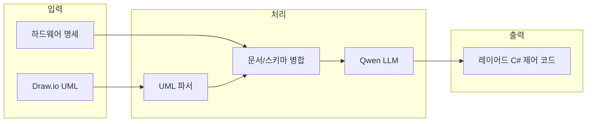

# 시스템 설계서 (코드 생성 서비스)

## 1. 개요

설비 설계 자료(하드웨어 명세 + Draw.io UML)를 입력받아 **레이어드 C# 제어 코드**를 생성하는 **LLM 기반 코드 생성 서비스**의 시스템 관점 설계를 정리한다.  
현재 단계는 **설계 문서 정리**이며, 실제 서비스 구현은 이후 단계에서 수행한다.

---

## 2. 서비스 아키텍처 (개념)

- **입력**: 하드웨어 명세(구조화 데이터), Draw.io UML(또는 추출된 동작/시퀀스 텍스트).
- **처리**: 레이어별 단계적 코드 생성 (Step 1 System → Step 2 Hardware → … → Step 5 Process). 각 단계에서 Qwen LLM을 호출하고, 해당 레이어 전용 프롬프트와 설계 자료·이전 단계 출력을 전달.
- **출력**: 레이어드 C# 제어 코드(파일 단위 또는 프로젝트 구조).

---

## 3. 데이터 흐름

1. 사용자(또는 상위 시스템)가 **하드웨어 명세**와 **UML 정보**(Draw.io 파일 또는 추출 텍스트)를 서비스에 전달.
2. 서비스는 **UML 파서**(필요 시)로 동작/시퀀스 구조를 추출하고, 하드웨어 명세와 병합하여 **레이어별 생성 요청**용 컨텍스트를 만든다.
3. **Step 1 ~ Step 5** 순서로 LLM(Qwen)을 호출하며, 각 단계별 프롬프트와 이전 단계 생성 결과를 넣어 해당 레이어 코드를 생성한다.
4. 생성된 코드를 **파일/프로젝트** 형태로 반환한다.

---

## 4. Qwen 연동 (개념 수준)

- **역할**: 코드 생성 각 단계(레이어별)에서 텍스트 프롬프트를 받아 C# 코드 텍스트를 생성.
- **입력**: 설계 자료 요약 + 이전 단계 생성 결과(경로·클래스/메서드 시그니처 등) + 레이어별 프롬프트 명세.
- **출력**: 지정된 형식(예: 파일 경로 + 코드 본문)의 텍스트.
- **배포**: 온프레미스 환경에서 Qwen 모델을 서비스 형태로 띄우고, 코드 생성 서비스가 해당 API를 호출하는 구성을 가정한다. (구체적 API·프로토콜은 구현 단계에서 정의.)

---

## 5. 배포 가정

- **환경**: 온프레미스(로컬 서버).
- **인증/권한**: 요구사항 명세서·추가 확정 사항에 따라 내부 인증(AD/LDAP 등) 필요 여부를 정한다.

---

## 6. 참조 문서

본 시스템 설계는 아래 문서를 전제로 한다.

| 문서 | 내용 |
|------|------|
| [02-설비제어코드-아키텍처.md](02-설비제어코드-아키텍처.md) | 생성 대상 코드의 5계층 구조 |
| [03-하드웨어명세-스키마.md](03-하드웨어명세-스키마.md) | 하드웨어 명세 구조·포맷 |
| [04-UML-동작명세-가이드.md](04-UML-동작명세-가이드.md) | UML 추출·동작 명세 규칙 |
| [05-레이어별-코드생성-프롬프트명세.md](05-레이어별-코드생성-프롬프트명세.md) | 레이어별 생성 절차·프롬프트 |
| [06-학습데이터-수집정제-가이드.md](06-학습데이터-수집정제-가이드.md) | 학습 데이터 수집·정제 |
| [08-API명세서.md](08-API명세서.md) | 코드 생성 API 요청/응답 (문서화) |

---

## 7. 미정 사항 (구현 시 확정)

- Draw.io 처리 위치: 서버 파싱 vs 사용자 제공 텍스트
- 생성 코드 배포 형태: 솔루션 전체 생성 vs 파일만 추가 vs 스니펫
- 생성 이력/버전 관리 정책
- 생성 코드 품질 검증(린트, 컴파일, 테스트) 자동화 여부
